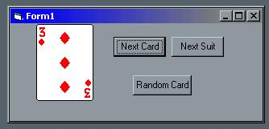



## Cards Ocx

### Description

This is a remake of vbcards.ocx. First you choose a suit, then a then a cardnumber, then use the showcard event to display the card. Uses enums for the suit list and the card list. You have to see this for your self.
 
### More Info
 

             |
---                |---
**Submitted On**   |2001-08-23 23:50:40
**By**             |[ttb](https://github.com/Planet-Source-Code/PSCIndex/blob/master/ByAuthor/ttb.md)
**Level**          |Intermediate
**User Rating**    |5.0 (15 globes from 3 users)
**Compatibility**  |VB 6\.0
**Category**       |[Games](https://github.com/Planet-Source-Code/PSCIndex/blob/master/ByCategory/games__1-38.md)
**World**          |[Visual Basic](https://github.com/Planet-Source-Code/PSCIndex/blob/master/ByWorld/visual-basic.md)
**Archive File**   |[Cards Ocx252518242001\.zip](https://github.com/Planet-Source-Code/ttb-cards-ocx__1-26597/archive/master.zip)

